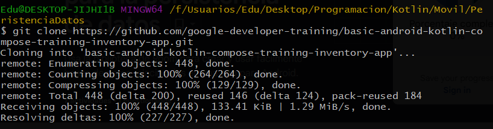
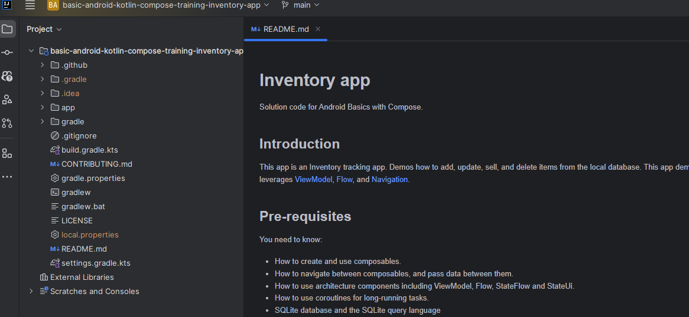
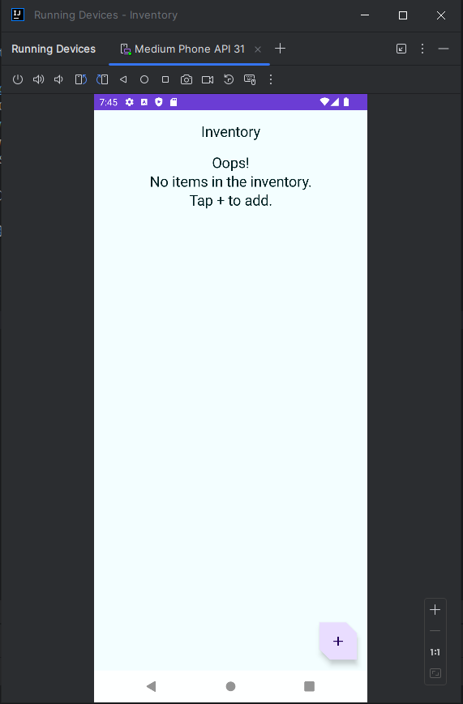
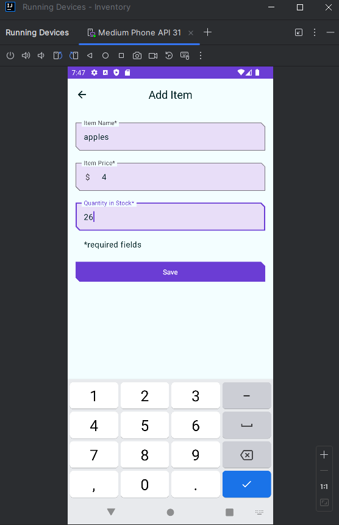
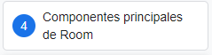
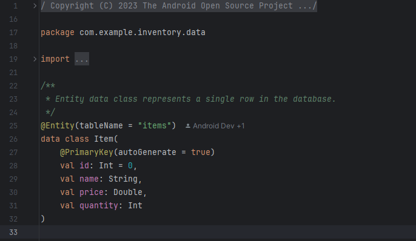
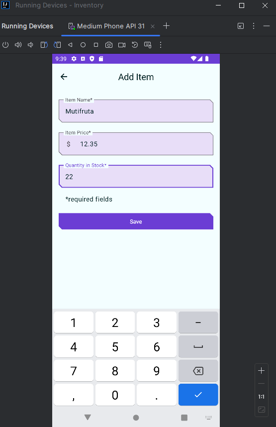
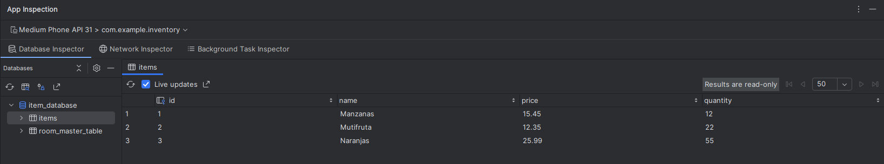

# Pacheco Cruz Eduardo | 6NM61 |

## Persistencia de Datos con Kotlin

### 1. Copiar el codigo del repositorio:



### 2. Abrir el proyecto en IntelliJ IDEA:



### 3. Corremos el proyecto:



Con el boton de "+", agregamos un nuevo registro al inventario:



**Nota:** Esta funcion aun no esta implementada.

### 4. Analizamos el codigo:

En esta parte analizamos las diferentes partes del proyecto como lo dice la parte de abajo de la imagen:



### 5. Creamos un elemento Entity:

Una clase Entity define una tabla, y cada instancia de esta clase representa una fila en la tabla de la base de datos. Asimismo, tiene asignaciones para indicarle a Room cómo pretende presentar la información en la base de datos e interactuar con ella. En tu app, la entidad conserva información sobre los elementos del inventario, como el nombre, el precio y la cantidad disponible.

Nos dirigimos a la carpeta "data" y creamos una nueva clase llamada "Item":



#### Clases de datos

Las clases de datos se usan principalmente para conservar datos en Kotlin. Se definen con la palabra clave data. Los objetos de clase de datos de Kotlin tienen algunos beneficios adicionales.Por ejemplo, el compilador genera automáticamente utilidades para comparar, imprimir y copiar elementos como toString(), copy() y equals().

```kotlin
// Example data class with 2 properties.
data class User(val firstName: String, val lastName: String){
}
```

1. Prefija la definición de la clase Item con la palabra clave data para convertirla en una clase de datos.

```kotlin
data class Item(
    val id: Int,
    val name: String,
    val price: Double,
    val quantity: Int
)
```

2. Sobre la declaración de clase Item, anota la clase de datos con **@Entity**. Usa el argumento tableName para establecer items como el nombre de la tabla de SQLite.

```kotlin
import androidx.room.Entity

@Entity(tableName = "items")
data class Item(
  ...
)
```

4. Anota la propiedad id con @PrimaryKey para que id sea la clave primaria. Una clave primaria es un ID para identificar de manera única cada registro o entrada en la tabla Item.

5. Asigna a id un valor predeterminado de 0, que es necesario para que id genere automáticamente valores de id.
6. Agrega el parámetro autoGenerate a la anotación @PrimaryKey para especificar si la columna de clave primaria se debe generar de forma automática. Si autoGenerate está configurado como true, Room generará automáticamente un valor único para la columna de clave primaria cuando se inserte una nueva instancia de entidad en la base de datos. Esto garantiza que cada instancia de la entidad tenga un identificador único, sin tener que asignar valores manualmente a la columna de clave primaria.

```kotlin
data class Item(
    @PrimaryKey(autoGenerate = true)
    val id: Int = 0,
    // ...
)
```

### 6. Crear un DAO

El objeto de acceso a datos (DAO) es un patrón que puedes usar para separar la capa de persistencia del resto de la aplicación proporcionando una interfaz abstracta. Este aislamiento sigue el principio de responsabilidad única, que viste en los codelabs anteriores.

1. En el paquete data, crea la interfaz de Kotlin ItemDao.kt.
1. Anota la interfaz ItemDao con @Dao.
1. Dentro del cuerpo de la interfaz, agrega una anotación @Insert.
1. Debajo de @Insert, agrega una función insert() que tome una instancia del item de la clase Entity como su argumento.
1. Marca la función con la palabra clave suspend para permitir que se ejecute en un subproceso separado.
1. Agrega un argumento onConflict y asígnale un valor de OnConflictStrategy.IGNORE. **En la app de Inventory, solo insertamos la entidad desde un lugar que es la pantalla Agregar elemento, por lo que no esperamos que haya ningún conflicto y podemos establecer la estrategia de conflicto como Ignorar.**

```kotlin
import androidx.room.OnConflictStrategy
@Insert(onConflict = OnConflictStrategy.IGNORE)
suspend fun insert(item: Item)
```

7. Agrega una función nueva con la anotación @Update que tome un Item como parámetro.
1. Al igual que con el método insert(), marca esta función con la palabra clave suspend.

```kotlin
import androidx.room.Update

@Update
suspend fun update(item: Item)
```

Agrega otra función con la anotación @Delete para borrar elementos y convertirla en una función de suspensión.

```kotlin
import androidx.room.Delete

@Delete
suspend fun delete(item: Item)
```

9. Escribe una consulta de SQLite para recuperar un elemento específico de la tabla de elementos según el id especificado. El siguiente código proporciona una consulta de muestra que selecciona todas las columnas de items, donde id coincide con un valor específico y id es un identificador único.

1. Agrega una anotación @Query.
1. Usa la consulta de SQLite del paso anterior como un parámetro de cadena a la anotación @Query.
1. Agrega un parámetro String a @Query, que es una consulta de SQLite para recuperar un elemento de la tabla correspondiente.
1. Después de la anotación @Query, agrega una función getItem() que tome un argumento Int y muestre un Flow<Item>

```kotlin
import androidx.room.Query
import kotlinx.coroutines.flow.Flow

@Query("SELECT * from items WHERE id = :id")
fun getItem(id: Int): Flow<Item>
```

14. Agrega una @Query con una función getAllItems().
1. Haz que la consulta de SQLite muestre todas las columnas de la tabla item, ordenadas de forma ascendente.
1. Haz que getAllItems() muestre una lista de entidades Item como Flow. Room mantiene este Flow actualizado por ti, lo que significa que solo necesitas obtener los datos de forma explícita una vez.

```kotlin
@Query("SELECT * from items ORDER BY name ASC")
fun getAllItems(): Flow<List<Item>>
```

### 7. Crea una instancia de base de datos

#### Crea la base de datos

En el archivo InventoryDatabase.kt crearemos la base de datos, queda de la siguiente manera siguiendo el codigo del codeLab:

```kotlin
@Database(entities = [Item::class], version = 1, exportSchema = false)
abstract class InventoryDatabase : RoomDatabase() {

    abstract fun itemDao(): ItemDao

    companion object {
        @Volatile
        private var Instance: InventoryDatabase? = null

        fun getDatabase(context: Context): InventoryDatabase {
            // if the Instance is not null, return it, otherwise create a new database instance.
            return Instance ?: synchronized(this) {
                Room.databaseBuilder(context, InventoryDatabase::class.java, "item_database")
                    .build()
                    .also { Instance = it }
            }
        }
    }
}
```

### 8. Implementa el repositorio

En esta tarea, implementarás la interfaz ItemsRepository y la clase OfflineItemsRepository para proporcionar entidades get, insert, delete y update de la base de datos.

ItemRepository.kt:

```kotlin
interface ItemsRepository {
    /**
     * Retrieve all the items from the the given data source.
     */
    fun getAllItemsStream(): Flow<List<Item>>

    /**
     * Retrieve an item from the given data source that matches with the [id].
     */
    fun getItemStream(id: Int): Flow<Item?>

    /**
     * Insert item in the data source
     */
    suspend fun insertItem(item: Item)

    /**
     * Delete item from the data source
     */
    suspend fun deleteItem(item: Item)

    /**
     * Update item in the data source
     */
    suspend fun updateItem(item: Item)
}
```

OfflineItemsRepository.kt:

```kotlin
import kotlinx.coroutines.flow.Flow

class OfflineItemsRepository(private val itemDao: ItemDao) : ItemsRepository {
    override fun getAllItemsStream(): Flow<List<Item>> = itemDao.getAllItems()

    override fun getItemStream(id: Int): Flow<Item?> = itemDao.getItem(id)

    override suspend fun insertItem(item: Item) = itemDao.insert(item)

    override suspend fun deleteItem(item: Item) = itemDao.delete(item)

    override suspend fun updateItem(item: Item) = itemDao.update(item)
}
```

#### Implementa la clase AppContainer

```kotlin
override val itemsRepository: ItemsRepository by lazy {
    OfflineItemsRepository(InventoryDatabase.getDatabase(context).itemDao())
}
```

### 9. Agrega la función de guardar

Abrimos el archivo ui/item/ItemEntryViewModel.kt. La clase de datos ItemUiState representa el estado de la IU de un elemento. La clase de datos ItemDetails representa un solo elemento.

La verdad aqui se modifican muchas cosas, principalmente el archivo

- ItemEntryViewModel.kt
- ui/AppViewModelProvider.kt

Puede entrar al codigo fuente para ver las modificaciones.

#### Agrega un objeto de escucha de clics al botón Save

- se modifico el archivo ItemEntryScreen.k

### 10. Consulta el contenido de la base de datos con el Inspector de bases de datos

En esta parte vamos a simular la app y vamos a agregar algunos elementos para ver si se guardan en la base de datos.



1. En Android Studio, selecciona View > Tool Windows > App Inspection en la barra de menú.

1. Elegimos la pestaña Database Inspector.

Podemos ver que se guardaron los elementos en la base de datos.


